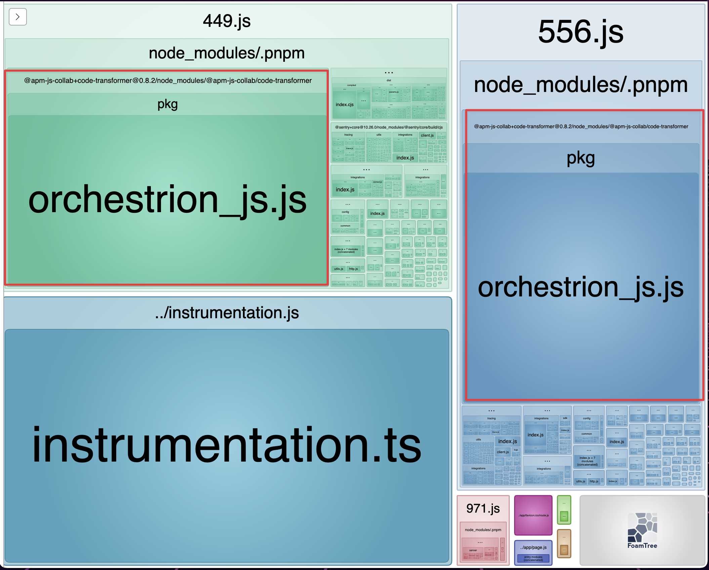
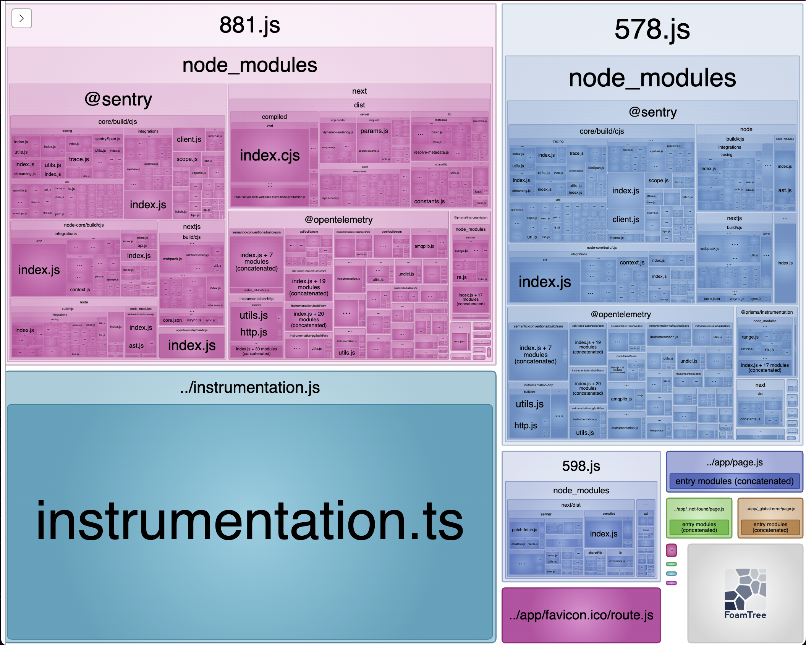

# Next.js Server Externals Issue Demo

This project demonstrates a Next.js externals issue when using the `serverExternalPackages` config option.

## Problem

We want to exclude `@apm-js-collab/tracing-hooks` from the server bundle.

Adding it to the `serverExternalPackages` config option works with yarn, but not with pnpm or npm.

It could be an issue of how package managers link the dependencies. It seems to work with direct dependencies, but not with indirect dependencies.

For example externalizing libraries like `pino` works with `serverExternalPackages` as long as it is a direct dependency.

Meanwhile `@apm-js-collab/tracing-hooks` is several layers deep in the dependency tree:

```
@sentry/nextjs 10.26.0
└─┬ @sentry/node 10.26.0
  └─┬ @sentry/node-core 10.26.0
    └── @apm-js-collab/tracing-hooks 0.3.1
```

## Running the project

Install the dependencies using either `pnpm` or `yarn` then build the app with `pnpm/yarn build:webpack`.

Depending on which package manager you use, the bundle analyzer will show different results.

### pnpm



### yarn



## Workaround

Adding it to the webpack config via the `webpack` config option works with all package managers.

Also setting either of the following in the `.npmrc` file makes externalizing libraries work with `pnpm`:

- `shamefully-hoist=true`
- `node-linker=hoisted`
